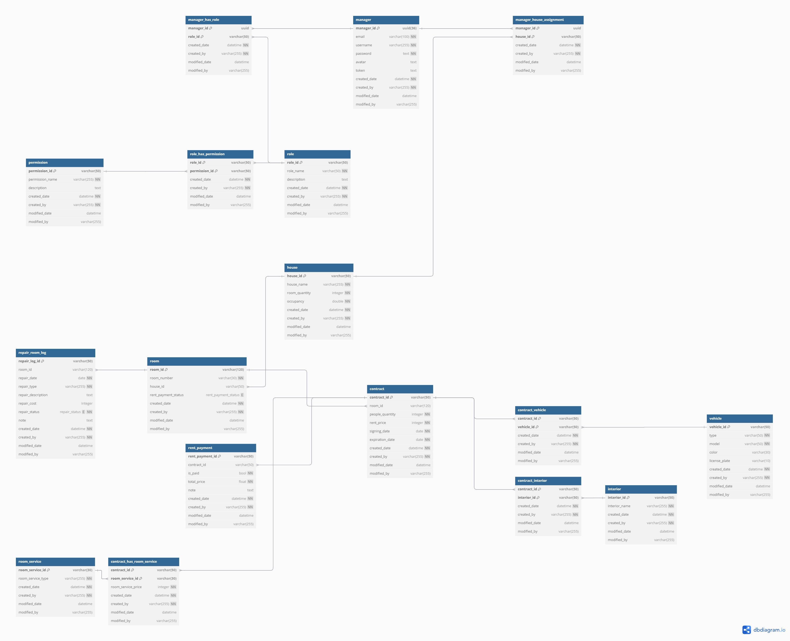

# EasyHostel Web Application Backend

EasyHostel is a hostel management system. This is the backend implementation, including all required functions and business logic.
This project provides an API for frontend to leverage. You should find more resources about the full project at the head of this file.

This codebase was created to demonstrate a full-fledged application built with Spring Boot including CRUD operations, authentication, authorization with RBA and more.

For more information about full project (documentation, design, frontend), head over here.

## Getting started

**NOTE**: default users come with the same username and password: "sysadmin", "admin", "user".

### Live demo

Here is the [live Swagger UI](https://easyhostel-backend.onrender.com/swagger-ui/index.html#/). Make sure you don't forget to get JWT with credentials provided.

Live application URL is `https://easyhostel-backend.onrender.com/api/{version}/`. In current state, it's `v1.0`. You can check the value at Swagger UI.

**NOTE**: This live demo uses free plan. It requires a bit of time to boot up. Because it will spin down with inactivity 🙂.

### Build from scratch

You can clone this repo and then use IntelliJ to run it normally. Just need to be aware of the default setup Postgresql info in `application` files and some notes about database below.

You can also use Maven commands to build it.

```shell
.\mvnw clean pakage -P dev

# Modify if necessary 
java -jar target/easyhostel-backend-1.0.0-SNAPSHOT.jar
```

Be aware of the profiles: dev, test, prod. The command above builds with dev profile.<br>
If you already have Postgresql installed in your machine, modify the username and password in `application` files.<br>

**NOTE**: you must have a table with `easyhostel` name before running application. You can use Docker for quick database installation.

```shell
# Using alpine for minimum usage
docker pull postgres:16.4-alpine

# Create Postgres container
docker run --name easyhostel-postgres -p 5432:5432 -e POSTGRES_USER=nyx -e POSTGRES_PASSWORD=123 -e POSTGRES_DB=easyhostel -d postgres:16.4-alpine

# Create Database named "easyhostel"
docker exec -it easyhostel-postgres psql -U nyx -c "CREATE DATABASE easyhostel;"
```

After you run it successfully, some default data will be inserted into database.<br>
Now the application is ready. You may want to have JWT first then use Swagger or Postman to test.

### Using Docker

You can set up it all using Docker. Here is how to do it.

Download `docker-compose.yml` file and run (in the same directory)
```shell
# Set up and run automatically
docker-compose up
```

This is recommended method. Because it assures all environment variables and connection to Postgresql will be configured correctly.

### How to test

## Overview

### Architecture

Using **Clean Architecture** to separate concerns and achieve great structure.

### Tech Stack

- Spring Boot
- Lombok
- MapStruct
- Postgresql

### Features

- Authentication
- Authorization with RBAC
- CRUD for all entities
- Validating input and business logic before performing any action
- i18n

### Design Principal

- Follow **Clean Architecture** when developing
- Try to follow **SOLID** rules
- Always `final` whenever possible
- Always package private class whenever possible
- Aim to solve real world problems
- Try to follow all modern best practices for Spring Boot project

### Diagrams

#### System flow diagrams

#### Database diagrams

You can find full database diagrams in [dbdiagram.io](https://dbdiagram.io/d/EasyHostel-668fe5889939893daeada0be)



### Project Structure

````
+---src
|   +---main
|   |   +---java
|   |   |   \---com
|   |   |       \---easyhostel
|   |   |           \---backend
|   |   |               |   EasyHostelApplication.java                  // Entry class
|   |   |               +---api                                         // API layer
|   |   |               |   \---controller                                  // Controllers
|   |   |               +---application                                 // Application layer
|   |   |               |   +---dto                                         // DTOs
|   |   |               |   +---mapping                                     // Interface mapper of entities
|   |   |               |   \---service                                     // Application services for entities
|   |   |               |       +---implementations                         
|   |   |               |       \---interfaces                                  
|   |   |               +---domain                                      // Domain layer
|   |   |               |   +---entity                                      // Entities  
|   |   |               |   |   +---base                                        // Base entity
|   |   |               |   |   \---embedded                                    // Embedded ID classes for entities   
|   |   |               |   +---enums                                       // Custom enum classes
|   |   |               |   +---exception                                   // Custom exception classes     
|   |   |               |   +---repository                                  // Entity repositories
|   |   |               |   |   \---interfaces                                  // Interface for repositories of entities
|   |   |               |   +---service                                     // Business validator services
|   |   |               |   |   +---implementation 
|   |   |               |   |   \---interfaces    
|   |   |               |   \---specification
|   |   |               \---infrastructure                              // Infrastructure layer
|   |   |                   +---configuration                               // Contains configuration files
|   |   |                   +---service                                         // Infrastructure service classes
|   |   |                   \---util                                            // Utility classes
|   |   |                       +---custom                                          // Custom classes
|   |   |                       \---generator                                       // Auto generate classes
|   |   |                               
|   |   \---resources                                               // Resource files        
|   |       |   
|   \---test                                                    // Test        
````

### Performance

## Contact

You can contract me with [email](mailto:thanhnam.awa@gmail.com) or issue in this project

## Licence

[MIT License](LICENSE)
